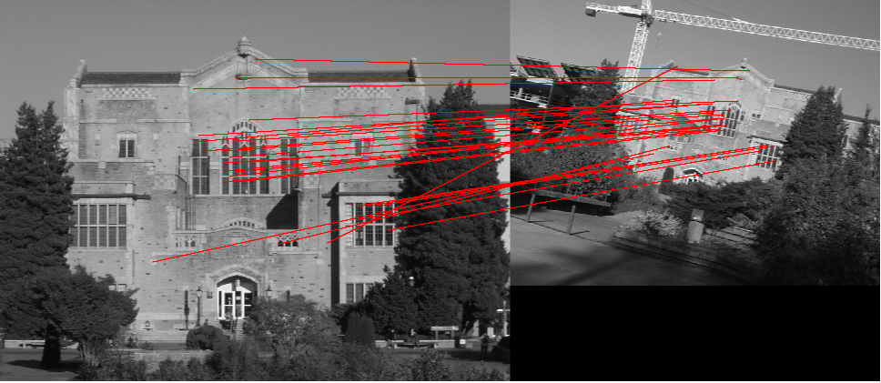
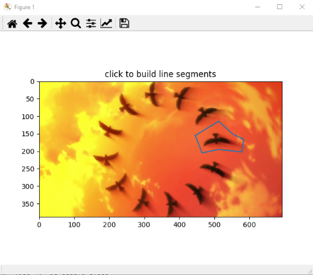
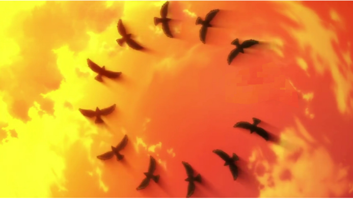
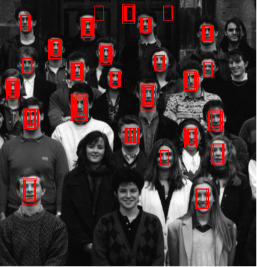
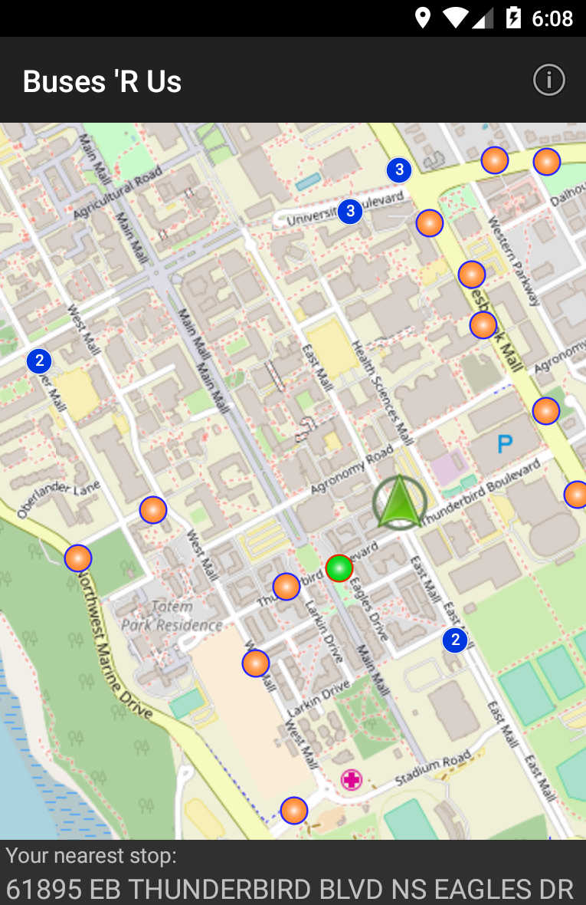
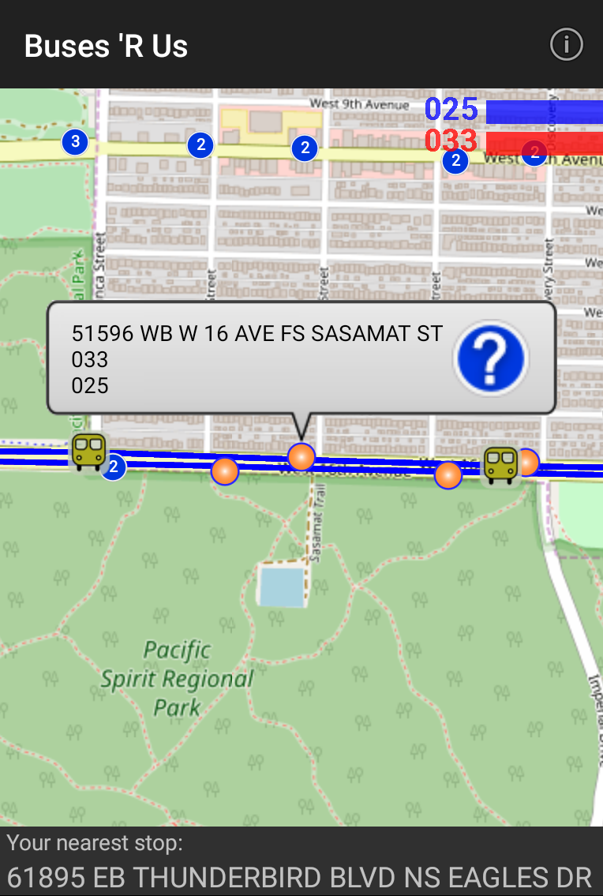
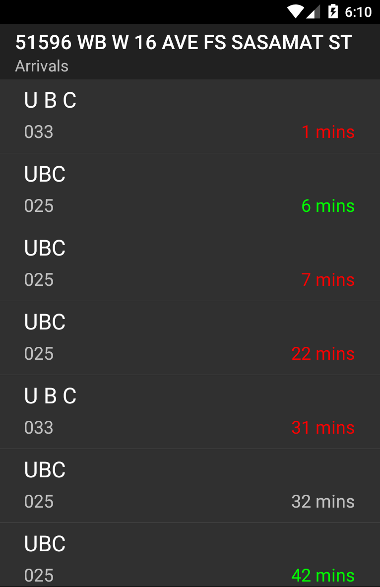

# About Me

Fourth year UBC BSc Computer Science 2022

---

## Personal Projects

### Rhyzinus (2021-2022)
A 3D rhythm game designed for mobile devices, inspired by Japanese arcade games and other mobile rhythm games. 
Development of the project is strongly focused on a polished rhythm game experience, with framerate-independent timing judgements and a custom build of the Godot game engine with audio modules for consistent low audio latency. 

Gameplay demo:
  <iframe width="560" height="315" src="https://www.youtube.com/embed/WmkENbeMcXo" title="YouTube video player" frameborder="0" allow="accelerometer; autoplay; clipboard-write; encrypted-media; gyroscope; picture-in-picture" allowfullscreen></iframe>
 

The level editor (a 2D desktop GUI application) was also created using the Godot game engine. This editor application behaves similarly to a simple MIDI editor that scrolls vertically, and it can easily be extended for additional gameplay elements. 
  <iframe width="560" height="315" src="https://www.youtube.com/embed/PXmPH6qa4-I" title="YouTube video player" frameborder="0" allow="accelerometer; autoplay; clipboard-write; encrypted-media; gyroscope; picture-in-picture" allowfullscreen></iframe>

 
### BMSdori (2019)
A fork of the iBMSC BMS editor written in Visual Basic, modified to render note types according to mobile rhythm game *BanG Dream! Girls Band Party!*  
Most notably, "slide" notes do not exist in most tradition BMS format games. This version of the editor render slide notes, which connect notes of the same slide type between lanes, while long notes pair to the next long note within its own lane only.  

With a little asset manipulation through tools like UABE and Unity AssetStudio, custom charts can be played in-game.  

  <iframe width="560" height="315" src="https://www.youtube.com/embed/0eTcIp8PGuo" frameborder="0" allow="accelerometer; autoplay; encrypted-media; gyroscope; picture-in-picture" allowfullscreen></iframe>

  
---

## Academic Projects

### Adrift in Somnium (2022)
A turn-based 2D roguelike dungeon RPG, developed in collaboration with 5 other students from the CPSC 427 course at UBC. 

As a roguelike game, levels, enemies, and in-game items are generated in a pseudo-random manner. Enemy behaviour is complex, with boss enemies using behaviour trees and common enemies using a custom queueing system to determine turn order and actions.

No game engines or game development libraries were used, aside from a simple entity-component system provided by the course instructors. 

[itch.io link for Adrift in Somnium](https://tocshi.itch.io/adrift-in-somnium)

 
### Locally Invariant Feature Matching (2019)
Written in Python. Given a pre-computed set of locally invariant keypoints and descriptors for an image, keypoints are matched between two images.  
Noise and outliers are reduced by first eliminating matches that have significantly different angles from the mean, then performing random sample consensus to narrow matches down to a group in which lines are closest to the mean.

 
### Texture Synthesis (2019)
A Python implementation of the Efros-Leung texture synthesis method. Select a region from which to sample the texture, and a region over which the texture will be synthesized, and a statistically similar texture will be generated.  

 
### Template Matching (2019)
Basic template matching techniques implemented in Python. The template image is tested at different scales, calculating correlation over each pixel and marking each pixel that correlates strongly enough to meet a threshold. Boxes centred around the marked pixels are then drawn based on the sizes of the matching templates.

 
### Color Filler (2018)
A program written in C++ that fills pixels in an image with a given pattern, continuing until it reaches a pixel that exceeds a threshold of color difference. It was implemented with different algorithms that determine the order in which pixels are filled. Below are examples of color filling implemented via breadth-first search (BFS) and depth-first search (DFS), respectively.

 
### BusesAreUs (2018)
An Android application written in Java that displays buses, routes, and stops on a map, and gives information on arriving buses for a specific stop when clicked. Students were responsible for writing code to parse data from the Translink API, then using the parsed data to display icons accurately over the map. Students also needed to display the nearest stop based on current GPS data from the device and ensure stops were clustered into a single icon at larger scales where too many icons would be rendered otherwise.

  
---
